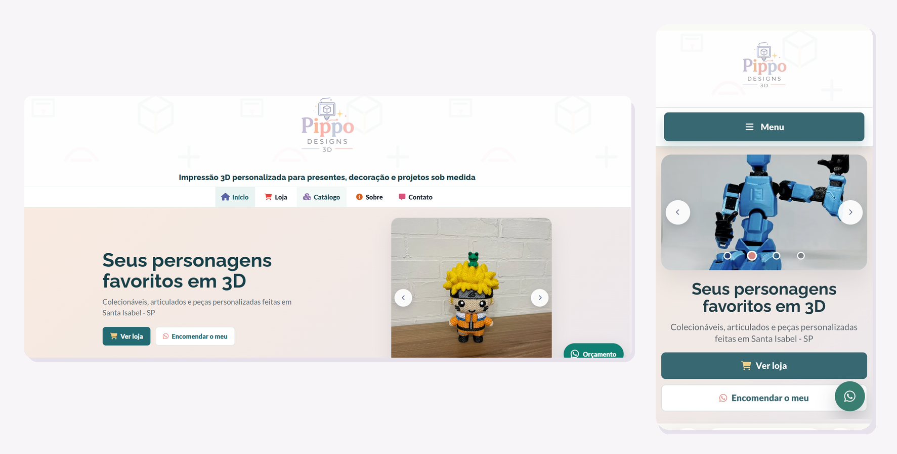

# 🧩 Pippo Designs 3D: site e loja online

Site oficial da **Pippo Designs 3D**, meu negócio de impressão 3D. Projetei, desenvolvi e mantenho o site sozinho, do zero, sem frameworks.

🔗 **No ar:** [pippodesigns3d.com.br](https://pippodesigns3d.com.br)



## 💡 O problema

Os clientes chegavam por Instagram, feira e indicação, e cada orçamento era montado na mão, no chat. Eu precisava de uma vitrine própria, rápida no celular, onde o cliente escolhe os produtos e chega no WhatsApp com o pedido pronto.

## ✨ Funcionalidades

- **Catálogo dinâmico** gerado a partir de JSON, com filtros por categoria e ordenação
- **Página de produto** montada via query string (`URLSearchParams`), com produtos relacionados
- **Kits configuráveis**: o cliente monta o próprio kit escolhendo as variações
- **Carrinho persistente** com `localStorage` e contador global no menu
- **Pedido via WhatsApp**: o carrinho vira uma mensagem formatada, pronta para enviar
- **Portfólio de projetos** sob encomenda (B2B), também alimentado por JSON
- Carrossel, lightbox de imagens, FAQ e formulário de contato com validação

## 🛠 Tecnologias

`HTML5` · `CSS3` · `JavaScript (ES6+)` · `JSON` · `Git` · `GitHub Pages` · domínio próprio

## ✅ Boas práticas aplicadas

- **Mobile first:** alvos de toque de 44px, menu mobile em grid e correção de overflow
- **Acessibilidade:** foco visível, contraste reforçado, menu fechado fora da ordem de foco
- **Performance:** imagens convertidas para WebP (800px) e animações com `IntersectionObserver`
- **SEO:** `sitemap.xml`, `robots.txt`, meta tags Open Graph (1200×630) e favicons
- **Segurança:** escape de HTML ao renderizar conteúdo dinâmico
- Preços formatados com `Intl.NumberFormat` (pt-BR)

## 🔍 Auditoria de UX e otimização

Depois da primeira versão no ar, fiz uma auditoria completa de usabilidade, desempenho e acessibilidade, e apliquei as melhorias por ordem de impacto:

- Fotos dos produtos convertidas para WebP: a loja ficou cerca de **5x mais leve**
- Prévia de compartilhamento (Open Graph) corrigida com URLs absolutas e imagem 1200×630
- Home reorganizada com foco em conversão: carrossel de produtos reais, categorias e mais vendidos acima da dobra
- Correção de alvos de toque, contraste e elementos flutuantes sobrepostos no mobile
- Padronização visual entre todas as páginas a partir de um sistema de cores e componentes

## 📂 Estrutura

```
├── index.html, loja.html, produtos.html, produto.html
├── projeto.html, sobre.html, contato.html, politica.html
├── products.json / projetos.json   → dados do catálogo e do portfólio
├── src/
│   ├── scripts.js                   → toda a lógica (catálogo, carrinho, UI)
│   ├── reset.css, estilo-global.css → base visual
│   └── estilo-*.css                 → estilos por página
├── produtos/                        → imagens dos produtos (WebP)
└── docs/                            → imagens do README
```

## ▶️ Como rodar localmente

```bash
git clone https://github.com/Bilugas/Pippo-Designs-3D.git
cd Pippo-Designs-3D
npx serve .
```

Ou abra a pasta no VS Code e use a extensão **Live Server**.

## 🚀 Próximos passos

- [ ] Checkout no próprio site com pagamento em Pix e cartão
- [ ] Dividir `scripts.js` em módulos ES (catálogo, carrinho, UI)
- [ ] Área administrativa para cadastrar produtos sem editar JSON
- [ ] Testes automatizados das regras do carrinho

## 👤 Autor

**Gabriel Pimentel**, desenvolvedor front-end jr. e fundador da Pippo Designs 3D
[LinkedIn](https://www.linkedin.com/in/gabriel-pimentel-silva) · [GitHub](https://github.com/Bilugas)
